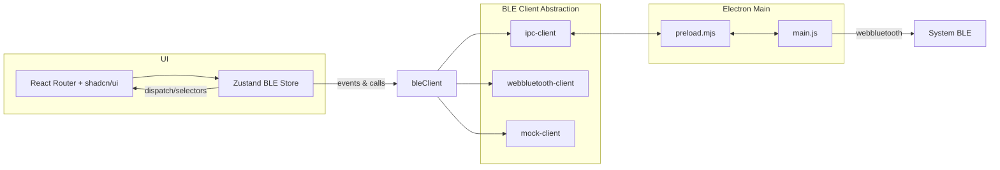

## XXII BLE Terminals

An Electron + React desktop application for discovering, connecting to, and interacting with Bluetooth Low Energy (BLE) devices through a modern, accessible terminal UI. Purpose-built for field engineers, firmware developers, QA teams, and support technicians who need a reliable and elegant BLE console for inspection, reads/writes, and stream subscriptions.

### TL;DR
- Modern BLE terminal for desktop (Electron) with a React UI and shadcn/ui components
- Fast scanning, stable connections, and a streaming console with framing, HEX/ASCII/UTF8, and virtualized logs
- Works with the `webbluetooth` node implementation of SimpleBLE in Electron; mock mode in the browser
- Keyboard shortcuts, accessibility, dark/light theme, and persistent per‑device settings


## Who this product is for
- Firmware engineers validating BLE characteristics and transport payloads
- Test/QA engineers automating manual checks, subscriptions, and data inspection
- Field technicians capturing logs and doing quick device sanity checks
- Developer relations/support teams reproducing customer environments


## Key capabilities
- Device discovery with RSSI strength indicators and connection-state badges
- One-click connect/disconnect with auto-enumeration of services and characteristics
- Read/Write and Subscribe/Unsubscribe across characteristics (notify/indicate)
- Terminal console with framing support and output formats: HEX, ASCII, UTF8
- Per-device settings persisted (format, framing, write target, subscriptions)
- Virtualized, accessible console able to handle long-running streams
- Keyboard shortcuts for common actions (scan, connect, disconnect, clear, focus)
- Dark/light/system theme with theme-aware components (shadcn/ui)


## Product walkthrough

### 1) Discover
- Start a scan from the left sidebar. Devices are listed with:
  - Name (fallback to formatted address), RSSI and strength, connection status
  - Accessible labels for screen readers and keyboard navigation

### 2) Connect
- Select a device and connect. The app automatically enumerates services and characteristics and displays capabilities (read, write, writeNoResp, notify, indicate).

### 3) Select targets and subscribe
- Choose read/notify/indicate targets and a single write target (write or writeNoResp). The app restores previous selections automatically when reconnecting a known device.

### 4) Send and observe
- Use the input field to send data using ASCII/UTF8/HEX. Configure framing: optional message start and delimiter; support for escaped sequences like \n, \r, and \xNN.
- Subscribed characteristics stream to the console. Logs are virtualized for performance.

### 5) Manage sessions
- Console supports “mark previous” when disconnecting, preserving historical context across sessions. Clearing is available via button and shortcut.


## Screens and components
- Device List: sortable/filtered sidebar with scan control, search, and status
- Device Details: top summary, connect/disconnect, expanded status, and terminal
- Terminal Console: active characteristics, per‑device settings dialog, virtualized console, input/send
- Settings Overlay: framing, formats, and advanced per‑device configuration

All UI uses shadcn/ui components with theme-aware tokens.


## Keyboard shortcuts
- Cmd/Ctrl+K: Focus message input
- Cmd/Ctrl+L: Clear console for the selected device
- Cmd/Ctrl+F: Focus search in the sidebar
- Cmd/Ctrl+R: Rescan for devices
- Cmd/Ctrl+Enter: Connect selected device
- Cmd/Ctrl+Shift+Enter: Disconnect selected device
- Cmd/Ctrl+B: Toggle sidebar
- Escape: Close overlays (handled by individual overlays)


## Data model and BLE concepts

### Core entities
- Device: id, name, address, rssi, connectionStatus, timestamps, flags
- Connection: deviceId, connected, services, timestamps
- Service: uuid, name, characteristics
- Characteristic: uuid, name, capabilities (read/write/writeNoResp/notify/indicate), subscribed flag
- ConsoleEntry: id, direction (in/out), timestamp, rawBytes, renderFormatAtTime, and ids for device/service/characteristic

### Per-device settings
- sendFormat: HEX | UTF8 | ASCII
- displayFormat: HEX | UTF8 | ASCII
- hexFillerPosition: beginning | end (for odd-length hex inputs)
- framing: messageStart and messageDelimiter
- splitFraming: optional alternate rxStart/rxDelimiter for inbound processing

### Framing and parsing
- Outbound writes: compose start bytes + payload + delimiter before sending
- Inbound notifications/reads: accumulate bytes and segment using configured delimiter; emit each complete payload as a console entry


## Architecture overview



### Key modules
- UI: `app/components/**` with shadcn/ui and Tailwind tokens
- Routing + Theme: `app/root.tsx`, `app/routes/home.tsx`, theme provider
- State: `app/lib/ble-store.ts` (actions, reducers, selectors, persistence, framing)
- BLE Client Abstraction: `app/lib/ble/index.ts` selects at runtime
  - `ipc-client.ts`: Electron renderer to main IPC bridge
  - `webbluetooth-client.ts`: Direct `webbluetooth` use (node implementation)
  - `mock-client.ts`: Browser-friendly behavior for development without Electron
- Electron: `main.js` (IPC, scanning, connect, read/write/subscribe), `preload.mjs` (contextBridge API)
- Storage: `app/lib/storage/index.ts` (auto-selects Electron vs in-memory)

### Event model (BLE)
- `scanStatus` { status: idle|scanning|completed|failed; deviceCount?; error? }
- `deviceDiscovered` Device
- `deviceUpdated` Device
- `connectionChanged` { deviceId; state: connecting|connected|disconnecting|disconnected|lost; connection? }
- `subscriptionChanged` { deviceId; serviceId; characteristicId; action: started|stopped }
- `characteristicValue` { deviceId; serviceId; characteristicId; value: Uint8Array; direction: read|write|notification }


## Runtime modes

### Electron (primary)
- Uses `webbluetooth` (node implementation of SimpleBLE) in the main process
- Preload (`preload.mjs`) exposes `bleAPI` and `storageAPI` to the renderer
- Renderer uses `ipc-client` to send BLE actions via IPC and receive events
- Storage persists with `electron-store` via `storageAPI`

### Browser (fallback)
- `bleClient` defaults to `mock-client` when `window.bleAPI` is not present
- In-memory storage emulates persistence for the session
- Useful for UI dev without a BLE stack


## Performance, stability, and UX
- Virtualized console via `@tanstack/react-virtual` for high-volume streams
- Batched device discovery and throttled flushing during scans to reduce UI churn
- HMR-safe event binding to prevent duplicate listeners in development
- Per-device UI state minimized to avoid referential churn; selectors cache
- Accessibility: screen reader announcements, accessible labels, focus handling
- Theme-aware design using Tailwind tokens: `bg-background`, `text-foreground`, `border-border`, etc.


## Project structure

```
app/
  components/ (shadcn/ui + custom UI)
  hooks/
  lib/
    ble/ (client abstraction)
    storage/ (electron or memory)
  routes/
  root.tsx
electron main & preload at repo root
```


## Development and scripts

Prerequisites: Node 20+, npm, macOS/Windows/Linux with BLE support

React app (builds SSR bundle via React Router dev tools):
```bash
npm run dev          # Start dev server
npm run build        # Build for production (server + client in /build)
npm run start        # Serve production build
```

Electron workflows:
```bash
npm run electron:dev         # Start Vite dev server + Electron (recommended)
npm run electron:dev:simple  # Alternative development setup
npm run electron:serve       # Serve built app with Electron
npm run electron:build       # Package app (mac/win/linux) into /release
```

macOS entitlements: Electron build config (in `package.json`) includes `NSBluetoothAlwaysUsageDescription` and `NSBluetoothPeripheralUsageDescription`.


## Theming and design system
- shadcn/ui components per project rule; import pattern:
  `import { Button } from "@/components/ui/button"`
- Theme via `ThemeProvider` in `app/root.tsx` (system default, manual toggle supported)
- Tailwind semantic tokens across components for light/dark parity


## Storage and persistence
Always use the storage abstraction so the correct backend is selected automatically:

```ts
import { storage } from '@/lib/storage';
```

Do not import `electron-storage` or `memory-storage` directly.

Persisted items (per device):
- `device:{id}:settings` — formats, framing, etc.
- `device:{id}:subscriptions` — active notify/indicate subscriptions
- `device:{id}:writeSelection` — selected write target and mode


## Extending the app

### Add a custom parser/framer
- Use `framingStringToBytes` in the store for parsing escape sequences
- Extend per‑device settings to define protocol‑specific delimiters or start/end bytes

### Add workflows or automations
- Compose new high‑level actions in `ble-store.ts` using existing `bleClient` calls
- Use selectors to derive minimal UI state and avoid unnecessary renders

### Support additional device profiles
- When connecting, the app enumerates services and characteristics; naming is derived from UUIDs (16‑bit collapse for SIG base UUIDs). Consider a local registry for friendly names if needed.


## Security & privacy
- BLE permissions requested by the OS at runtime (Electron build config contains usage descriptions on macOS)
- No network transmission of BLE payloads by default; persistence is local via `electron-store`
- When sharing logs, scrub device addresses or sensitive payloads as needed


## Known constraints
- Browser-only mode runs in mock BLE; actual BLE requires Electron runtime
- Some platforms may limit service/characteristic enumeration behavior; the Electron main process implementation attempts to discover primary, all, and included services


## SaaS landing page brief (for marketing site implementation)

### Target audiences
- Firmware engineers and embedded developers
- QA and test engineers validating BLE stacks
- Field/service technicians needing quick diagnostics
- Developer support and solutions engineers

### Value propositions
- “Connect and debug BLE in seconds” — zero-config terminal with sensible defaults
- “Reliable streams, readable logs” — framing, HEX/ASCII/UTF8, and durable virtualized console
- “Engineer‑grade UX” — keyboard shortcuts, accessible labels, and themeable design
- “Persistent device context” — settings and subscriptions restored on reconnect

### Core features to highlight
- BLE scanning with signal quality
- Service/characteristic enumeration with capability badges
- Read/Write/Notify/Indicate with per‑device write target selection
- Framing and encoding controls (HEX/ASCII/UTF8, start/delimiter, RX split)
- Virtualized terminal and message copy
- Keyboard shortcuts and dark/light mode

### Differentiators
- Electron-backed `webbluetooth` (SimpleBLE) for robust, cross-platform desktop BLE
- Thoughtful state model (Zustand) with batched discovery and reconnection flows
- Accessibility and performance baked in

### Social proof ideas
- Short case studies: “Commissioned 50 devices in one afternoon”, “Caught a framing bug in minutes”
- Logos of device manufacturers and labs (with permission)

### Pricing scaffolding (suggestion)
- Free: basic scanning, connect, console; local persistence
- Pro: multiple saved profiles, advanced framing presets, export/import sessions, multi‑window
- Team: shared presets, audit logs, priority support

### Call‑to‑action copy
- Primary: “Download for macOS/Windows/Linux”
- Secondary: “See it in action” (short demo video)

### SEO keywords
- BLE terminal, Bluetooth Low Energy console, BLE debug tool, GATT characteristic inspector, Electron BLE app

### Visuals to capture (for landing)
- Device list with signal bars and statuses
- Services & Characteristics editor dialog
- Console with inbound/outbound badges and framing examples
- Light and dark theme variants


## Repository housekeeping
- Follow project rules: always use shadcn/ui components; respect theme tokens
- Use `storage` abstraction (do not import electron or memory storage directly)
- Prefer a single import/scan/connect lifecycle and reuse the existing connection


## License
Proprietary. All rights reserved. Contact the maintainers for licensing inquiries.
